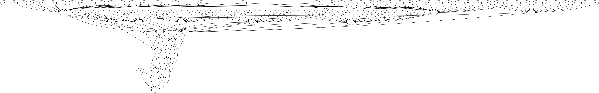

# Multi-project build

This test project is a "hierarchical" multi-project (or multi-module in the Maven world) build:
   - 100 projects
   - each project has 500 source files
   - inter-project dependencies simulate "real world" projects with "upper" projects depending on up-to 3 "lower level" projects
   


This allows us to test 2 different scenarios :

- making an ABI (application binary interface) breaking change in a low-level dependency
- making an ABI-compatible change in a low-level dependency
   
# Instructions

Assuming you have installed `gradle-profiler`, as described in the top-level readme.

For Gradle:

```
gradle-profiler --scenario-file performance.scenarios --project-dir . --benchmark --gradle-version 3.3
```

(replace 3.3 with the version of Gradle you want to test, or a path to a local install)

For Apache Maven:

```
export MAVEN_HOME=/path/to/apache-maven
export MAVEN_OPTS="-Xms2g -Xmx2g"
gradle-profiler gradle-profiler --scenario-file performance.scenarios --project-dir . --benchmark --maven
```


